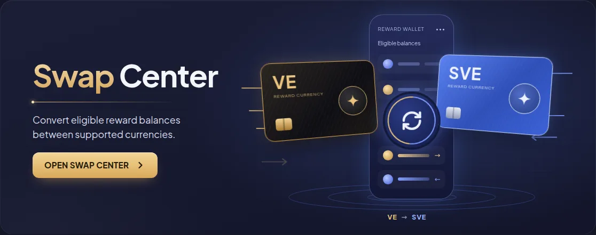
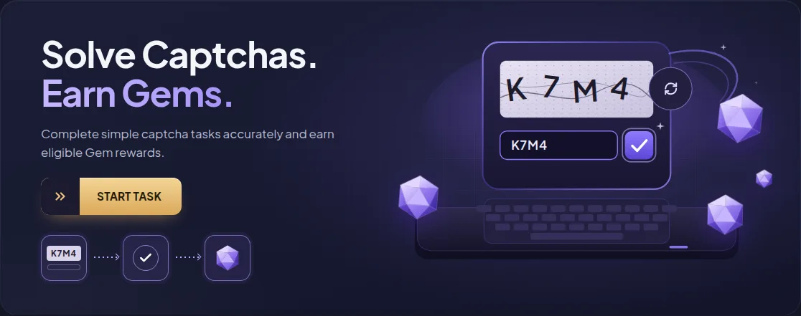
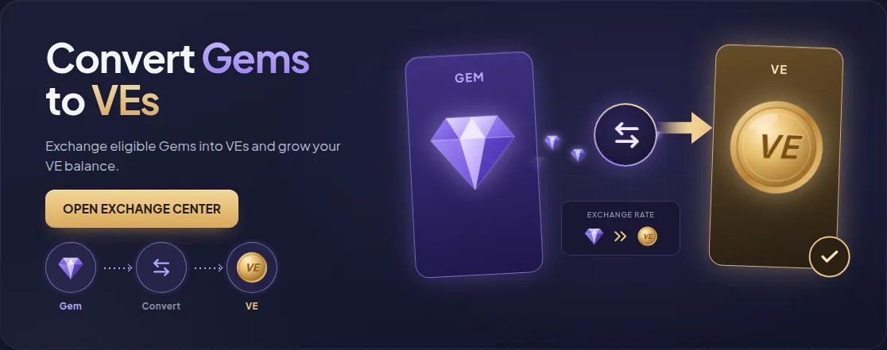

# VELOOP Rewards — Feature Banners

A redesign of five promotional banners for **VELOOP Rewards**, built with React and Vite for internship Task 08 (Rewards & Engagement Banner/Card Redesign).

Each banner explains one feature at a glance: what it is, why it matters, and what to do next. They share one design system but each has its own illustration, layout and interaction.


---

## Banner list

| # | Banner | Heading | CTA → route | Main interaction |
|---|--------|---------|-------------|------------------|
| 1 | Refer & Earn | Refer Friends, Earn Rewards | Invite now → `/refer-and-earn`<br>How it works → `/refer-and-earn#how-it-works` | Copy button copies the referral code; reward values count up |
| 2 | Swap Center | Swap Center | Open Swap Center → `/swap-center` | Swap button switches the VE and SVE cards and the direction |
| 3 | Bonus VEs | Boost Your VE Balance | Explore bonuses → `/bonus-ves` | Activities tick one by one and fill the bonus meter |
| 4 | Captcha Tasks | Solve Captchas. Earn Gems. | Start task → `/captcha-tasks` | Captcha is typed, verified, and a Gem is collected; refresh loads a new code |
| 5 | Exchange Center | Convert Gems to VEs | Open Exchange Center → `/exchange-center` | Gems stream into the VE card; Gem → Convert → VE steps light up |

### Swap Center vs Exchange Center

The brief asks for these to look clearly different:

- **Swap Center** is a **two-way conversion** between platform currencies (VE ↔ SVE). It uses a wallet phone and two payment-style cards, and the swap button reverses the direction.
- **Exchange Center** is a **one-way redemption** (Gem → VE). It uses tall balance cards, a single arrow, and a "received" check at the end.

---

## Features

- All five banners as separate React components, built on a shared `BannerShell`
- 100% width, with heights kept inside the required range on every device (see below)
- A large illustration on every banner, drawn in SVG and CSS. There are no image files to download, and everything stays sharp at any size.
- At least one meaningful animation and one interaction per banner
- Every CTA is a real link to a working route; unknown URLs show a "Page not found" page
- The Refer & Earn page has a working "Share on WhatsApp" link
- Keyboard accessible, with visible focus rings, labelled controls and screen-reader descriptions of each illustration
- Respects the operating system's **reduced motion** setting: animations stop and final states show straight away
- Deep links work after deployment (SPA fallback for Vercel and Netlify)

---

## Technology stack

| Purpose | Library |
|---------|---------|
| UI | React 19 with hooks |
| Build tool | Vite 8 |
| Layout and base styles | Bootstrap 5.3 (container, reset, utilities) |
| Component styles | CSS Modules (`.module.css`) |
| Routing | React Router 7 |
| Icons | Lucide React; React Icons (WhatsApp share) |
| Font | Plus Jakarta Sans (self-hosted via Fontsource) |
| Linting | oxlint |

---

## Installation

Requires **Node.js 20.19+** (or 22.12+) and npm.

```bash
git clone https://github.com/<bhavanaconnects>/<veloopproject>.git
cd <veloopproject>
npm install
```

## Development commands

| Command | What it does |
|---------|--------------|
| `npm run dev` | Start the dev server at http://localhost:5173 |
| `npm run build` | Create the production build in `dist/` |
| `npm run preview` | Serve the production build locally |
| `npm run lint` | Run oxlint on the project |

---

## Folder structure

```
src/
├── components/
│   ├── BannerShell/          # shared frame: width, heights, surface, entrance, hover
│   ├── CTAButton/            # link-as-button with gold / pill / split / accent / ghost variants
│   ├── FlowSteps/            # small "A → B → C" sequence (Captcha, Exchange)
│   ├── RewardArt/            # SVG VE coin, Gem, V token
│   ├── ReferEarnBanner/      # + People.jsx (characters), GiftBox.jsx
│   ├── SwapCenterBanner/     # + CurrencyCard.jsx
│   ├── BonusVEsBanner/       # + BonusScene.jsx
│   ├── CaptchaTasksBanner/   # + CaptchaDevice.jsx
│   ├── ExchangeCenterBanner/
│   └── SiteHeader/
├── hooks/
│   ├── useInView.js          # start animations only when a banner is visible
│   ├── usePrefersReducedMotion.js
│   ├── useCountUp.js         # animated reward numbers
│   └── useTypewriter.js      # captcha typing
├── pages/
│   ├── RewardsPage.jsx       # all five banners
│   ├── FeaturePage.jsx       # demo destination for each CTA
│   └── NotFoundPage.jsx
├── utils/
│   ├── bannerData.js         # dummy data (see "Dummy data")
│   ├── routes.js
│   └── clipboard.js
├── styles/
│   ├── tokens.css            # colours, type, radii, motion
│   └── global.css
├── App.jsx
└── main.jsx
docs/screenshots/             # README images
public/_redirects             # Netlify SPA fallback
vercel.json                   # Vercel SPA fallback
netlify.toml                  # Netlify build settings
```

**Reuse without sameness.** `BannerShell` handles what must be identical everywhere: width, height ranges, card surface, entrance and hover. Each banner owns its layout and illustration, so no two look alike.

---

## Responsive design

Heights follow the assignment's ranges and were measured at 10 widths from 320px to 1920px:

| Device | Breakpoint | Required height | Measured |
|--------|-----------|-----------------|----------|
| Mobile | < 768px | 330–520px | 380–496px |
| Tablet | 768–991px | 380–540px | 380–394px |
| Laptop / desktop | ≥ 992px | 410–450px | 440px |

- **Mobile:** each banner stacks as illustration, heading, description, then CTA. The illustration stays large. The Refer & Earn feature strip and small badge are hidden to stay within 520px.
- **Tablet:** two columns (content and illustration). The Refer & Earn strip shows titles only.
- **Desktop:** two columns with the illustration taking the larger share.
- Illustrations scale as one unit using SVG `viewBox` or CSS container query units (`cqw`), so their proportions never stretch.
- No banner has horizontal overflow or clipped content at any tested width.


---

## Animation details

All animations use CSS transforms and opacity (GPU-friendly) or small React state changes. Sequences start only when a banner scrolls into view, and each plays once.

| Banner | Ambient motion | Triggered motion |
|--------|----------------|------------------|
| Refer & Earn | V tokens bob, confetti twinkles | Reward values count up; gift tilts on hover; copy button confirms |
| Swap Center | Gold and blue arrows stream in; swap ring rotates | Cards slide and swap sides on click; card sheen sweeps on hover |
| Bonus VEs | Coin on the pedestal hovers, loose coins drift, "+" badge pulses | Activities tick in turn, flow lines animate, gold meter fills |
| Captcha Tasks | Gems float, sparkles twinkle | Code types in, verify button activates, a Gem flies to the pile; refresh spins |
| Exchange Center | Gem particles travel toward the VE card | Steps light up, gold arrow extends, "received" check pops in |

Every banner also has a one-time entrance, hover elevation and CTA hover, active and focus states.

---

## Accessibility

- Every banner is a `<section>` labelled by its heading
- Illustrations are `<figure>` elements with a screen-reader description (`figcaption`); decorative SVGs are hidden from assistive tech
- Interactive parts of illustrations are real `<button>`s with clear labels (copy code, swap direction, new captcha)
- Status changes (code copied, swap direction, captcha verified) are announced with `aria-live`
- Visible gold focus ring on every focusable element; a "Skip to content" link
- Touch targets are at least 48px (CTAs) or 32px (small icon buttons)
- Reduced-motion support in both CSS and JavaScript

## Performance

- No raster images, videos or Lottie files; all artwork is inline SVG and CSS
- Animations run only while useful: sequences start on scroll into view and run once
- Fonts are self-hosted, so there are no third-party font requests
- Production bundle: about 101 kB JS gzipped, including React, React Router and icons

---

## Dummy data

Backend integration is out of scope. All data lives in `src/utils/bannerData.js`.

> **The reward amounts shown (You earn 500 VEs, Your friend gets 200 VEs) are sample values copied from the design.** They are not official VELOOP rewards. The banner shows a "Sample values" tag while `isSample` is `true`. Replace them with the approved referral rules before release.

The design's feature-strip claims ("100% Secure", "Instant Rewards", "Unlimited Earning") were reworded to "Secure tracking", "Rewards together" and "Invite more". This avoids promising anything the product hasn't approved.

---

## Screenshots

| Banner | Desktop (1280px) |
|--------|------------------|
| Refer & Earn |  |
| Swap Center |  |
| Bonus VEs |  |
| Captcha Tasks |  |
| Exchange Center |  |

---

## Live demo

**Add your link here after deploying:** `https://<veloopproject>.vercel.app`

### Deploy on Vercel
1. Push this project to GitHub (see below).
2. Sign in at [vercel.com](https://vercel.com) with GitHub and choose **Add New → Project**.
3. Import the repository. Vercel detects Vite automatically (build: `npm run build`, output: `dist`).
4. Click **Deploy**. `vercel.json` already makes routes like `/swap-center` work on refresh.

### Or deploy on Netlify
1. Sign in at [netlify.com](https://netlify.com) and choose **Add new site → Import an existing project**.
2. Pick the GitHub repository. `netlify.toml` sets the build command and publish folder.
3. Deploy. `public/_redirects` handles route refreshes.

After deploying, open every CTA and refresh on each route to confirm there are no 404s or console errors.

## GitHub repository

**Add your link here:** `https://github.com/<bhavanaconnects>/<veloopproject>`

```bash
git init
git add .
git commit -m "VELOOP Rewards feature banners"
git branch -M main
git remote add origin https://github.com/<bhavanaconnects>/<veloopproject>.git
git push -u origin main
```

`.gitignore` already excludes `node_modules/`, `dist/`, `.env` files, logs and editor folders.

---

## Author

**M BHAVANA**
Frontend Development Intern, VELOOP Rewards
Intern ID: VLRINT202601714